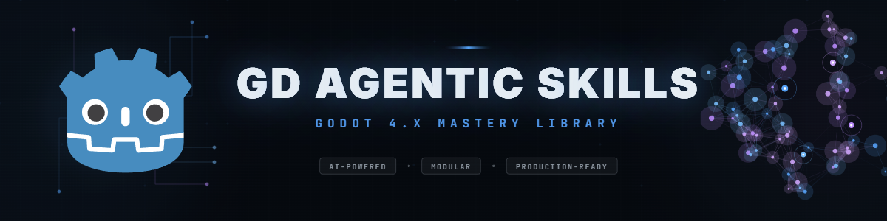

# Godot Game Dev Studio — Multi-Agent Skills for Godot 4.7+

**Godot Game Dev Studio** is a portable **multi-agent skill library for Godot 4.7+ game development**, assembled and curated by **[Powehi](https://powehi.eu)**.

It packages a broad agentic skill library for **Godot architecture**, **GDScript patterns**, **gameplay systems**, **UI/UX**, **animation**, **2D/3D physics**, **shaders**, **optimization**, **publishing workflows**, **genre blueprints**, **Godot addon examples**, and **studio-style orchestration roles**.

This repository is designed for Codex, Claude Code, Cursor, and VS Code + Copilot. It includes and adapts open gamedev skill resources from several projects, including **[Divergent AI / GD Agentic Skills](https://github.com/thedivergentai/gd-agentic-skills)**, **[awesome-gamedev-agent-skills](https://github.com/gamedev-skills/awesome-gamedev-agent-skills)**, **[GodotPrompter](https://github.com/jame581/GodotPrompter)**, **[Claude-Code-Game-Studios](https://github.com/Donchitos/Claude-Code-Game-Studios)**, and **[godot-worldmap-builder](https://github.com/don-tnowe/godot-worldmap-builder)**. See [NOTICE.md](NOTICE.md) for provenance and credits.

## Overview

Godot Game Dev Studio helps AI coding agents act as a game-development studio assistant for Godot projects. It is useful for planning and implementing gameplay features, reviewing GDScript architecture, designing reusable game systems, modernizing Godot 4.7+ projects, selecting specialist skills, and coordinating AI-assisted game-development workflows.

Relevant areas include:

- Godot 4.7+ game development
- GDScript architecture and code review
- Godot 2D and 3D systems
- game AI, combat, quests, inventory, dialogue, save systems, and UI
- shader programming and visual effects
- procedural generation and level design
- performance optimization and release readiness
- Steam, itch.io, desktop, mobile, web, VR, and multiplayer workflows
- Codex skills, AI coding agents, and agentic game-development workflows

<div align="center">
  
</div>

## Credits

- **Plugin assembly, Codex packaging, curation, icon, and distribution**: [Powehi](https://powehi.eu)
- **Original GD Agentic Skills library and many Godot skill resources**: [Divergent AI](https://github.com/thedivergentai)
- **Imported `gamedev-*` skill family**: [gamedev-skills / awesome-gamedev-agent-skills](https://github.com/gamedev-skills/awesome-gamedev-agent-skills)
- **Imported `godot-prompter-*` skill family**: [jame581 / GodotPrompter](https://github.com/jame581/GodotPrompter)
- **Studio orchestration inspiration for `studio-*` skills**: [Donchitos / Claude-Code-Game-Studios](https://github.com/Donchitos/Claude-Code-Game-Studios)
- **Bundled Godot world-map builder sample/addon resources**: [don-tnowe / godot-worldmap-builder](https://github.com/don-tnowe/godot-worldmap-builder), MIT licensed; see `assets/godot-worldmap-builder/LICENSE.md`
- **Godot Engine** is a trademark of its respective maintainers; this project is not affiliated with or endorsed by the Godot Foundation.

## Provenance by folder

| Path prefix | Main provenance |
| --- | --- |
| `skills/godot-*` | Divergent AI / GD Agentic Skills, with Powehi curation and Codex packaging |
| `skills/gamedev-*` | gamedev-skills / awesome-gamedev-agent-skills |
| `skills/godot-prompter-*` | jame581 / GodotPrompter |
| `skills/studio-*` | Powehi Codex adaptation inspired by Donchitos / Claude-Code-Game-Studios |
| `assets/godot-worldmap-builder/` | don-tnowe / godot-worldmap-builder |

## What is included

- `skills/` — Codex skills and reference material for Godot/game-development workflows
- `assets/` — plugin visuals, banners, and selected supporting examples
- `.codex-plugin/plugin.json` — Codex plugin manifest
- `skills_index.json` — machine-readable skill index
- `update_skills_index.py` — helper script for regenerating the index

## Who this is for

- Godot developers using Codex or AI coding agents
- solo game developers who want senior-level implementation guidance
- teams building reusable Godot gameplay architecture
- studios prototyping game systems with AI-assisted workflows
- developers migrating projects to Godot 4.7+
- maintainers who want structured Godot skills instead of one-off prompts

## Codex plugin installation

This plugin is intended to be installed through a local Codex marketplace entry or from a cloned repository.

For a local personal marketplace workflow:

```powershell
codex plugin add godot-game-dev-studio@personal
```

After installing or updating the plugin, open a new Codex task/thread so Codex reloads the plugin skills.

## Recommended usage

Use the studio/router skills when the request is broad:

- new game feature planning
- project architecture
- gameplay system design
- code review or modernization
- Godot 4.7 migration
- performance and release readiness

Use individual specialist skills when the request is narrow:

- camera systems
- save/load
- tilemaps
- shaders
- 2D physics
- UI theming
- platform export
- genre-specific mechanics

## Skills and orchestrators

The library contains 189 specialist skills. Route first, load only relevant `SKILL.md` files, then read their required references. Do not load entire library into one task.

| Family | Count | Use it for |
| --- | ---: | --- |
| `godot-*` | 96 | Godot 4.7+ engine systems: architecture, scenes, signals, GDScript, UI, animation, physics, navigation, shaders, multiplayer, testing, optimization, export, platforms, and genre mechanics. |
| `godot-prompter-*` | 54 | Structured workflows for controllers, abilities, addons, C#, networking, localization, UI, resources, save/load, XR, and third-party Godot tools. |
| `gamedev-*` | 27 | Cross-engine design workflows: genres, game feel, levels, procedural generation, publishing, audio, camera, AI, and game-jam scope. |
| `studio-*` | 12 | Multi-discipline orchestration: route broad requests, coordinate specialists, set quality gates, and prepare release work. |

### Studio orchestrators

Use one orchestrator for broad or cross-discipline work. It selects specialist skills; it does not replace them.

| Orchestrator | Responsibility |
| --- | --- |
| [`studio-router`](skills/studio-router/SKILL.md) | First entry for ambiguous, multi-discipline, or project-stage requests; routes skills and quality gates. |
| [`studio-game-director`](skills/studio-game-director/SKILL.md) | Game concept, pillars, audience, genre fit, player fantasy, and feature purpose. |
| [`studio-producer`](skills/studio-producer/SKILL.md) | Milestones, scope, sequencing, risks, acceptance criteria, and cross-team handoffs. |
| [`studio-godot-technical-director`](skills/studio-godot-technical-director/SKILL.md) | Engine architecture, Godot APIs, scene structure, addons, budgets, networking, and exports. |
| [`studio-gameplay-lead`](skills/studio-gameplay-lead/SKILL.md) | Movement, combat, abilities, enemies, camera, input, feedback, and core loop. |
| [`studio-systems-designer`](skills/studio-systems-designer/SKILL.md) | Inventory, stats, economy, quests, progression, resources, balance, and save/load. |
| [`studio-level-design-lead`](skills/studio-level-design-lead/SKILL.md) | Maps, tiles, worlds, encounters, procedural content, and world-map screens. |
| [`studio-narrative-content-lead`](skills/studio-narrative-content-lead/SKILL.md) | Dialogue, quests, localization, narrative structure, and story-system integration. |
| [`studio-ui-ux-game-lead`](skills/studio-ui-ux-game-lead/SKILL.md) | HUD, menus, controller navigation, accessibility, responsive `Control` layouts, and game UX. |
| [`studio-godot-addon-integrator`](skills/studio-godot-addon-integrator/SKILL.md) | Addons, editor plugins, tool scripts, native extensions, and dependency isolation. |
| [`studio-qa-playtest-lead`](skills/studio-qa-playtest-lead/SKILL.md) | Test plans, playtests, regressions, bug triage, accessibility checks, and feature acceptance. |
| [`studio-performance-release-lead`](skills/studio-performance-release-lead/SKILL.md) | Profiling, optimization, platform readiness, releases, hotfixes, and patches. |

### Catalog

The full linked catalog is exposed below. Use scope to choose family, then open only skill matching task.

| Catalog family | Scope | Skills |
| --- | --- | --- |
| Godot engine | Godot 4.7+ architecture, scenes, GDScript, animation, physics, navigation, shaders, UI, networking, testing, optimization, exports, platforms, and genre systems. | [96 `godot-*` skills](SKILL_CATALOG.md#godot--skills--96) |
| GodotPrompter workflows | Structured implementation for systems, addons, C#, UI, multiplayer, resources, localization, XR, and production workflows. | [54 `godot-prompter-*` skills](SKILL_CATALOG.md#godot-prompter--skills--54) |
| Game development | Game design, genres, game feel, level design, procedural generation, publishing, camera, AI, and game jams. | [27 `gamedev-*` skills](SKILL_CATALOG.md#gamedev--skills--27) |
| Studio orchestration | Routing, creative and technical direction, production, gameplay, systems, QA, release, UX, level, narrative, and addon work. | [12 `studio-*` skills](SKILL_CATALOG.md#studio--skills--12) |

<details>
<summary>Godot engine catalog — 96 skills</summary>

Domains: 2D/3D animation, physics, lighting, materials, world building, abilities, adaptation, navigation, architecture, audio, cameras, combat, composition, debugging, dialogue, economy, exports, game loops, GDScript, genres, input, inventory, multiplayer, particles, performance, platforms, procedural generation, projects, quests, raycasts, resources, RPG stats, save/load, scenes, servers, shaders, signals, state machines, tests, themes, tilemaps, turns, tweens, and UI.

[Open all 96 direct skill links.](SKILL_CATALOG.md#godot--skills--96)
</details>

<details>
<summary>GodotPrompter catalog — 54 skills</summary>

Domains: 2D/3D essentials, abilities, addons, AI navigation, animation, assets, audio, cameras, components, C#, servers, dependency injection, dialogue, events, exports, GDExtension, GDScript, reviews, debugging, optimization, setup, tests, UI, HUD, input, inventory, localization, mobile, multiplayer, multithreading, VFX, physics, player controllers, procedural generation, resources, responsive UI, save/load, scenes, shaders, state machines, tweens, and XR.

[Open all 54 direct skill links.](SKILL_CATALOG.md#godot-prompter--skills--54)
</details>

<details>
<summary>Game-development catalog — 27 skills</summary>

Domains: audio, camera, card games, dialogue, FPS, game AI, game feel, game jams, UI/UX, input, itch.io, levels, performance, physics tuning, platformers, procedural generation, prototypes, puzzles, roguelikes, routing, RPGs, saves, shaders, Steam, survival crafting, tower defense, and visual novels.

[Open all 27 direct skill links.](SKILL_CATALOG.md#gamedev--skills--27)
</details>

Current package size:

| Family | Count | Purpose |
| --- | ---: | --- |
| `godot-*` | 96 | Core Godot expert skills |
| `godot-prompter-*` | 54 | GodotPrompter-style implementation workflows |
| `gamedev-*` | 27 | General game-development workflows |
| `studio-*` | 12 | Studio-role orchestration |
| **Total** | **189** | Full Godot Game Dev Studio library |

Current package highlights and searchable keywords:

- Godot 4.7+ guidance
- GDScript patterns
- Godot game architecture
- Godot gameplay systems
- Godot AI navigation
- Godot shaders and materials
- Godot UI and UX
- Godot multiplayer networking
- Godot performance optimization
- game genre patterns
- game publishing workflows
- Godot addon examples
- Codex studio orchestrators

## AI coding tool compatibility

This repository is usable beyond Codex because the skills are plain Markdown files. Compatibility instructions are included for:

- Claude Code: [CLAUDE.md](CLAUDE.md) plus native project skills and subagents in [`.claude/`](.claude/)
- VS Code GitHub Copilot: [.github/copilot-instructions.md](.github/copilot-instructions.md)
- Cursor: [.cursor/rules/godot-game-dev-studio.mdc](.cursor/rules/godot-game-dev-studio.mdc)
- Gemini CLI: [GEMINI.md](GEMINI.md)
- Codex and generic agents: [AGENTS.md](AGENTS.md)

See [COMPATIBILITY.md](COMPATIBILITY.md) for setup guidance and recommended workflows.

### Claude Code native workflow

Claude Code reads [CLAUDE.md](CLAUDE.md) automatically and discovers tracked project extensions in [`.claude/`](.claude/). Integration adds focused entry points without copying the 189-skill library into Claude startup context.

| Component | Invocation | Purpose |
| --- | --- | --- |
| [`godot-route`](.claude/skills/godot-route/SKILL.md) | `/godot-route` | Select smallest relevant skill set, load selected instructions, then continue task. Use before broad planning, implementation, debugging, or review. |
| [`godot-library-check`](.claude/skills/godot-library-check/SKILL.md) | `/godot-library-check` | Run metadata, plugin, and whitespace validation after skill or compatibility changes; does not regenerate derived files by default. |
| [`godot-skill-router`](.claude/agents/godot-skill-router.md) | Delegate by name | Read-only subagent. Search catalog and return up to three relevant skills. |
| [`godot-quality-reviewer`](.claude/agents/godot-quality-reviewer.md) | Delegate by name | Read-only Godot 4.7+ review: static typing, API, lifecycle, performance, and selected-skill anti-patterns. |

Keep personal permissions, credentials, and machine paths in `.claude/settings.local.json`; Git ignores that file. Restart Claude Code once when opening session created before `.claude/` existed.

## Development workflow

Validate plugin manifest and skill metadata with installed Codex plugin tooling before publishing. Then reinstall:

```powershell
codex plugin add godot-game-dev-studio@personal
```

## License

This distribution is released under the **GNU Lesser General Public License v3.0**. See [LICENSE](LICENSE).

Some bundled third-party materials may include their own license notices. See [NOTICE.md](NOTICE.md) and the relevant files under `assets/`.

## Maintainer

Maintained and packaged by **[Powehi](https://powehi.eu)**.
